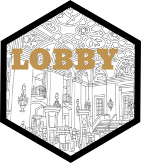

<!-- README.md is generated from README.Rmd. Please edit that file -->

```{r, include = FALSE}
knitr::opts_chunk$set(
  collapse = TRUE,
  comment = '#>',
  fig.path = 'man/figures/README-',
  out.width = '100%'
)
```

# lobby <a href="http://christophertkenny.com/lobby/"></a>

<!-- badges: start -->
[](https://lifecycle.r-lib.org/articles/stages.html#stable)
[](https://github.com/christopherkenny/lobby/actions/workflows/R-CMD-check.yaml)
<!-- badges: end -->

`lobby` provides access to the US Senate's Lobbying Disclosure Act API.

## Installation

You can install the development version of `lobby` like so:

``` r
pak::pak('christopherkenny/lobby')
```

## Example

To get filings, simply use the `lob_list_filings()` function to list all filings that match your criteria. 
For example, to get all filings for Harvard University in 2025:

```{r example}
library(lobby)
lob_list_filings(client_name = 'Harvard University', filing_year = 2025)
```

You can also request the next set using the `lob_request_next()` function.
Here, we also artificially shorten the results to 3 per page.

```{r}
lob_list_filings(
  client_name = 'Harvard University',
  filing_year = 2025,
  page_size = 3
) |>
  lob_request_next()
```

To get more details, you can retrieve a specific filing by its UUID using `lob_retrieve_filing()`:

```{r}
lob_retrieve_filing(filing_uuid = '0463abad-89e8-4d9d-b72c-a0b8aa66c6b0')
```

Similar endpoints exist for clients, lobbyists, registrants, and contributions.
You can look up constants that can used for filtering using the `lob_constants_*()` functions.

## Authentication

To sign up for an API key, visit the [US Senate's Lobbying Disclosure Act API](https://lda.senate.gov/api/register/) sign-up website. 

Once you have your key, you can set it in your environment as `USSLDA_KEY`.
You can:

1. Add this directly to your `.Renviron` file with a line like so

```r
USSLDA_KEY='yourkey'
```

If doing this, I recommend using `usethis::edit_r_environ()` to ensure that you open the correct .Renviron file.

2. Set this in you current R session with `Sys.setenv(USSLDA_KEY='yourkey')`.

3. Set this using the `lobby::set_lobby_key()` function. To save this for future sessions, run with `install = TRUE`.
